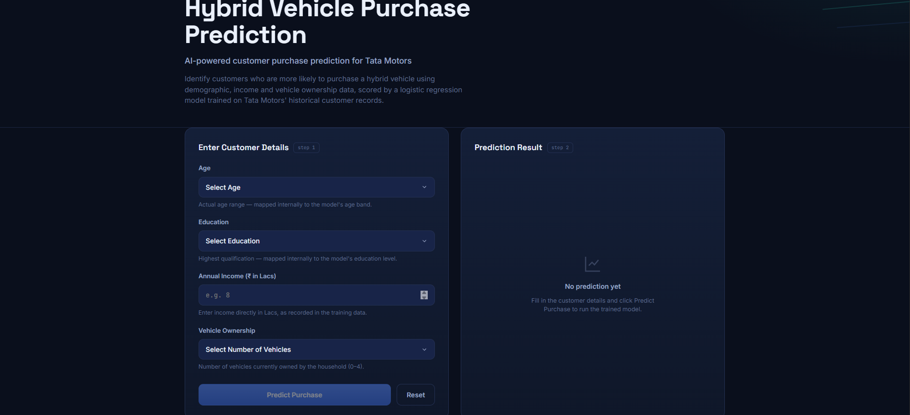
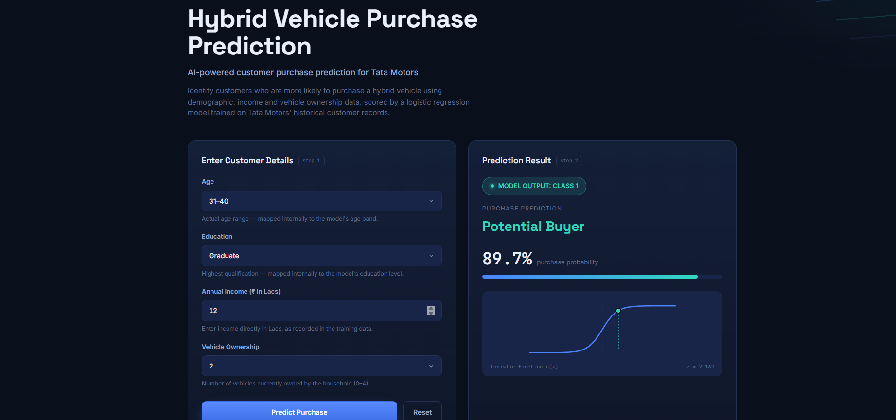
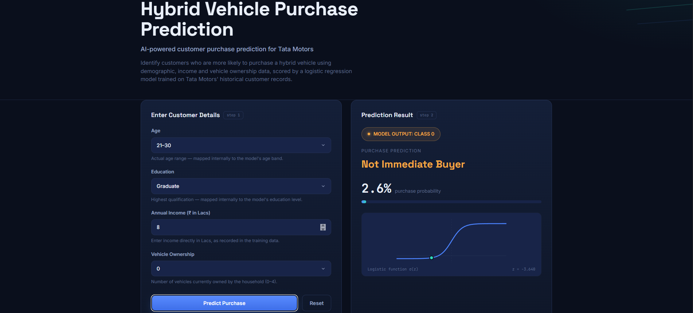

# 🚗 Hybrid Vehicle Purchase Prediction

## 🚀 Live Demo

Try the working web application:

👉 **[Hybrid Vehicle Purchase Prediction – Live Demo]([https://hybrid-predict-pro.lovable.app/](https://akshatraghav22.github.io/hybrid-vehicle-purchase-prediction/))**

Enter customer details such as Age, Education, Income and Vehicle Ownership to receive a hybrid vehicle purchase prediction.

A Machine Learning web application that predicts whether a customer is likely to purchase a hybrid vehicle using Logistic Regression.

The project was developed around a Tata Motors business problem: identifying potential customers for a new hybrid vehicle launch and supporting targeted marketing and sales decisions.



### 🟢 Potential Buyer Prediction



### ⚪ Not Immediate Buyer Prediction



---

## 📌 Business Problem

Tata Motors is planning to launch a new hybrid vehicle and wants to understand which customers are more likely to purchase it.

The objective is to build a classification model that predicts customer purchase intent based on:

- Age
- Education
- Income
- Vehicle Ownership

The prediction classifies customers into:

- 🟢 **Potential Buyer**
- ⚪ **Not Immediate Buyer**

---
## 📊 Project Highlights

- 475 customer records
- Logistic Regression classification
- 4 input features
- 89.26% training accuracy
- Real-time prediction interface
- FastAPI backend
- Responsive web application

## 🎯 Project Objective

The main objectives of this project are to:

- Predict hybrid vehicle purchase intent
- Identify potential customers
- Support targeted marketing campaigns
- Help sales teams prioritize potential buyers
- Demonstrate the use of Logistic Regression in a real-world business scenario

---

**Logistic Regression**

The model was implemented using:

```python
from sklearn.linear_model import LogisticRegression
